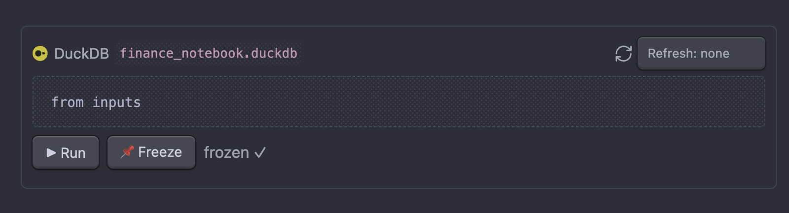
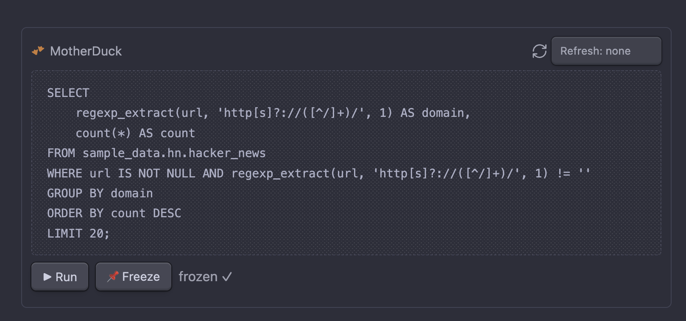
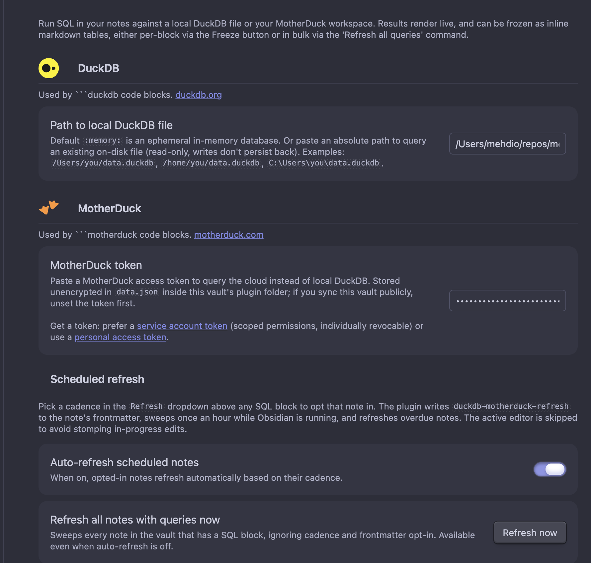

# DuckDB & MotherDuck for Obsidian

Run DuckDB SQL directly inside your notes. Freeze the results as a plain markdown table so both you and any agent that reads the vault see `query + result` as one document.

Works entirely offline with local DuckDB WASM. Add a MotherDuck token to query your cloud data alongside, picking per code block which connection to use.

## What it does

- **`duckdb` / `motherduck` code blocks**: render a SQL panel in reading mode with a ▶ Run button and a connection badge showing which engine the block runs against.
- **Freeze**: "Freeze query at cursor" or the 📌 button in reading mode runs the query and writes the result as a markdown table directly below the block, bracketed by sentinel comments.
- **Refresh**: "Refresh all queries in this note" re-runs every SQL block and replaces its frozen output.
- **Scheduled refresh**: pick a daily / weekly cadence per note via the per-block dropdown; the plugin sweeps once an hour while Obsidian runs and refreshes overdue notes automatically. Activity log + manual "Refresh now" button in plugin settings.
- **Plugin API**: `app.plugins.getPlugin('duckdb-motherduck').api.refreshFile(path)` and `.runQuery(sql, connection?)` (where `connection` is `"local"` or `"cloud"`, defaulting to `"local"`), so Claude Code or other agents can trigger refreshes via `obsidian eval`.

## Freeze format

````markdown
```motherduck
SELECT brand, SUM(revenue) FROM sales GROUP BY 1 ORDER BY 2 DESC LIMIT 10
```
<!-- md:cache hash=a3f847b2 conn=cloud ts=2026-04-24T14:22:00Z rows=10 -->

| brand | sum(revenue) |
| ----- | ------------ |
| acme  | 42000        |
| ...   | ...          |

<!-- md:cache-end -->
````

The sentinel carries a query hash, connection, timestamp, and row count. Refresh/freeze replaces the sentinel block below the query.

## Connections

Each block picks its backend via the fence type. Both connections can be configured at once and used side-by-side in the same note.

| Fence            | Backend                   | Needs token | Reaches cloud |
| ---------------- | ------------------------- | ----------- | ------------- |
| ` ```duckdb `    | `@duckdb/duckdb-wasm`     | no          | no            |
| ` ```motherduck `| `@motherduck/wasm-client` | yes         | yes           |

A rendered local block:



A rendered cloud block:



Local DuckDB has three sub-modes, set via the **Path to local DuckDB file** setting:

- `:memory:` (default), ephemeral in-memory database. Reset on every Obsidian restart.
- A bare filename like `notes.duckdb` for a persistent database in browser-managed storage (Origin Private File System). Survives Obsidian restart, full read/write, lives outside your vault.
- An absolute path like `/Users/you/data.duckdb` or `C:\Users\you\data.duckdb` to query an existing `.duckdb` file from disk. **Read-only**: writes succeed inside the worker but don't persist back to the file.

## Install (manual, for now)

The plugin isn't in the Obsidian community store yet. To install:

1. Clone this repo.
2. `npm install && npm run build`, produces `main.js`.
3. Copy `main.js`, `manifest.json`, and `styles.css` into `<your-vault>/.obsidian/plugins/duckdb-motherduck/`.
4. In Obsidian: Settings → Community plugins → enable *DuckDB & MotherDuck*.

## Usage

Create code blocks tagged with the connection you want:

````markdown
```duckdb
-- runs against your local DuckDB
SELECT 42 AS answer, now() AS ts
```

```motherduck
-- runs against MotherDuck (needs a token in plugin settings)
SELECT current_database(), current_timestamp
```
````

In reading mode each block shows its connection badge (`DuckDB :memory:` or `MotherDuck`), a `Refresh: none / daily / weekly` dropdown for scheduled refresh (see below), and the ▶ Run / 📌 Freeze buttons.

From the command palette:

- **Refresh all queries in this note**, re-runs every block in the current note.
- **Freeze query at cursor**, freezes the block the cursor is on.
- **Reset DuckDB/MotherDuck connections**, drops both connections; useful after changing the path or token.

## Settings



- **DuckDB → Path to local DuckDB file**: `:memory:` (default), an OPFS bare filename, or an absolute file path. See *Connections* above.
- **MotherDuck → Token**: optional. Stored plaintext in the plugin's `data.json` (see *Security* below). Prefer a [service account token](https://motherduck.com/docs/key-tasks/service-accounts-guide/create-and-configure-service-accounts/) for scoped, individually revocable access; or a [personal access token](https://motherduck.com/docs/key-tasks/authenticating-and-connecting-to-motherduck/authenticating-to-motherduck/#authentication-using-an-access-token) for quick experimentation.
- **Scheduled refresh**: see the next section.
- **General → Row cap**: max rows rendered inline or written into a frozen table. A truncation notice is appended if exceeded.

## Scheduled refresh

Pick a cadence in the **Refresh** dropdown above any SQL block to opt that note in for auto-refresh. The plugin writes a `duckdb-motherduck-refresh: daily | weekly` property to the note's frontmatter:

```yaml
---
duckdb-motherduck-refresh: daily
duckdb-motherduck-refresh-last: 2026-05-04T10:30:00Z   # plugin-managed
---
```

While Obsidian is running and the **Auto-refresh scheduled notes** toggle is on, the plugin sweeps once an hour. Notes whose `last - now` exceeds their cadence get their frozen tables re-materialized. The active editor is skipped to avoid stomping in-progress edits.

The settings page also has:

- A **Refresh now** button: forces a sweep of *every note in the vault that has a SQL block*, regardless of cadence or frontmatter opt-in. Useful before reading a dashboard, or for one-shot refreshes.
- An **Activity log** showing the last 100 refresh attempts (timestamp, trigger, path, blocks refreshed, first error message if any). Click a path to open the note. **Clear log** wipes history.

## Agent trigger

Both the human button and the agent flow share the same code path. From a shell (with the [Obsidian CLI](https://github.com/Yakitrak/obsidian-cli) installed):

```sh
obsidian eval code="app.plugins.getPlugin('duckdb-motherduck').api.refreshFile('path/to/note.md')"
```

...or wire it into a Claude Code skill. The plugin reports the number of blocks refreshed.

## Build from source

```sh
npm install
npm test         # automated unit tests for parser/cache/table helpers
npm run build     # production bundle, main.js
npm run dev       # watch mode, rebuilds on save
```

`main.js` ends up around 2 MB because the local DuckDB WASM worker script is bundled inline. The `.wasm` binary itself is fetched from jsDelivr at runtime (see *Remote assets*).

## Remote assets

When a `duckdb` block runs, the plugin fetches the DuckDB WASM binary (~7 MB gzipped) from jsDelivr the first time:

```
https://cdn.jsdelivr.net/npm/@duckdb/duckdb-wasm@<version>/dist/duckdb-eh.wasm
```

When a `motherduck` block runs, the MotherDuck WASM extension and its DuckDB worker bundle are fetched from `https://app.motherduck.com/duckdb-wasm-assets/<version>/` during connection setup.

Both are cached by the browser. No other network activity is added by the plugin.

## Requirements

- Obsidian 1.5+
- Desktop (tested on macOS; Windows/Linux expected to work, end-to-end testing pending). On mobile: `:memory:` and OPFS modes should work; absolute-path mode requires Node integration not available on mobile.
- Internet connection on first use (to download wasm assets).

## Security

The MotherDuck token, if set, is stored plaintext in `<vault>/.obsidian/plugins/duckdb-motherduck/data.json`. Don't commit that file. Don't sync your vault publicly with a token in it. Keychain integration isn't implemented; this matches the Obsidian-plugin-ecosystem norm (no plugin SDK API for encrypted secrets, no native deps shipped via the community store).

Queries run locally (`duckdb` blocks) or against your MotherDuck account (`motherduck` blocks). No telemetry is sent by the plugin.

## Known limitations

- **No mobile validation**, the architecture should work in mobile Obsidian for `:memory:` and OPFS modes, but hasn't been tested on iOS/Android. Absolute-path mode requires Node integration which isn't available on mobile.
- **Read-only for on-disk files**, pointing at a real `.duckdb` file lets you query it, but writes (`CREATE` / `INSERT` / `UPDATE`) succeed only inside the worker and don't persist back to the file.
- **Scheduled refresh runs only while Obsidian is open.** If you want notes refreshed while your laptop is asleep or Obsidian is closed, you need an external trigger (e.g. cron + the Obsidian CLI calling the plugin's API).
- **No keychain integration for the MotherDuck token**, stored plaintext in `data.json`. See *Security*.

## License

MIT. See `LICENSE`.
