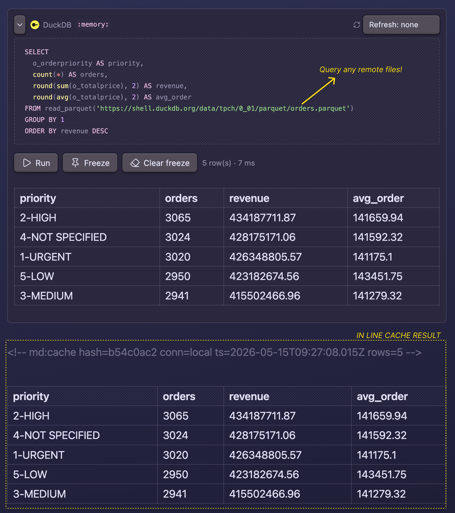
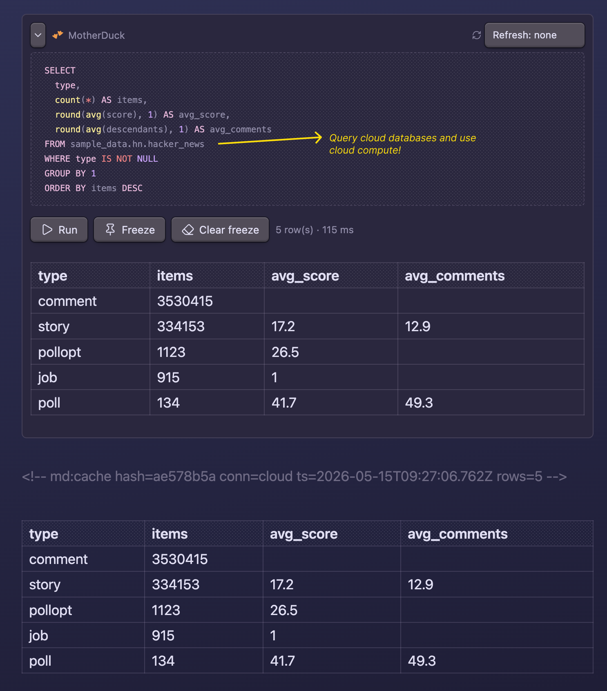

# DuckDB & MotherDuck for Obsidian

Bring **external data** into your Obsidian notes via DuckDB SQL, then freeze the results as a plain markdown table so you and any agent reading the vault see `query + result` as one document.

Works entirely offline with local DuckDB WASM. Add a MotherDuck token to query your cloud data alongside, picking per code block which connection to use.

- **Query any local or remote file**: Parquet, CSV, JSON, Excel, Iceberg, Delta, geospatial. Anything DuckDB reads.
- **Cache results inline as markdown**: freeze the query output right under the SQL so the note becomes a self-contained document, readable in any editor.
- **Scheduled refresh**: pick a daily or weekly cadence per note; the plugin re-runs the queries automatically while Obsidian is open.
- **MotherDuck for cloud data and compute**: add a token to query cloud databases or push heavy SQL onto MotherDuck instead of your laptop.

## Quick start

Install via *Community plugins* (see [Install](#install)), then paste this block into any note:

````markdown
```duckdb
SELECT
  o_orderpriority AS priority,
  count(*) AS orders,
  round(sum(o_totalprice), 2) AS revenue
FROM read_parquet('https://shell.duckdb.org/data/tpch/0_01/parquet/orders.parquet')
GROUP BY 1
ORDER BY revenue DESC
```
````

In reading mode the block becomes a SQL panel with **Run** / **Freeze** / **Clear freeze** buttons. Hit *Freeze* and the result drops in as a markdown table right under the SQL, bracketed by sentinel comments so the next refresh knows what to replace.



Add a [MotherDuck token](#install) in Settings to enable `motherduck` blocks against cloud databases or heavier compute:



For a fuller tour (two local DuckDB blocks, three MotherDuck blocks, a hybrid template), drop [`docs/demo.md`](docs/demo.md) into your vault and run **Refresh all queries in this note** from the command palette.

## Why this and not Dataview?

Dataview is the go-to plugin for querying *the vault itself* — your frontmatter, tags, and links across notes. This plugin solves the opposite problem: pulling **external data** (CSV, Parquet, JSON, Excel, Iceberg, Delta, geospatial files, plus your MotherDuck cloud) into a note via DuckDB SQL, and joining across them when you want.

- Use **Dataview** for "list every note tagged #project, sorted by created date."
- Use **this** for "the latest revenue numbers from my warehouse, joined with a local expenses CSV."

Output is regular markdown wrapped in sentinel comments — so it diffs cleanly in git, renders in any editor (Neovim, VS Code, mobile previews), and stays readable to agents reading the vault.

## When to use it

- Embedding live numbers in a blog draft (e.g. `SELECT count(*) FROM read_parquet('events.parquet')`).
- Quick exploration of a CSV/Parquet/Excel file in your data folder without leaving Obsidian.
- Snapshotting a MotherDuck query into a weekly report note (with [scheduled refresh](#scheduled-refresh)).
- Joining a local file (e.g. expenses CSV) with cloud tables in MotherDuck.

## Freeze format

````markdown
```motherduck
SELECT brand, SUM(revenue) FROM sales GROUP BY 1 ORDER BY 2 DESC LIMIT 10
```
<!-- md:cache hash=a3f847b2 conn=cloud ts=2026-04-24T14:22:00Z rows=10 -->

| brand | sum(revenue) |
| ----- | ------------ |
| acme  | 42000        |
| ...   | ...          |

<!-- md:cache-end -->
````

The sentinel carries a query hash, connection, timestamp, and row count. Refresh and freeze replace the sentinel block below the query in place.

## Connections

Each block picks its backend via the fence type. Both connections can be configured at once and used side-by-side in the same note.

| Fence            | Backend                   | Needs token | Reaches cloud |
| ---------------- | ------------------------- | ----------- | ------------- |
| ` ```duckdb `    | `@duckdb/duckdb-wasm`     | no          | no            |
| ` ```motherduck `| `@motherduck/wasm-client` | yes         | yes           |

Local DuckDB has three sub-modes, set via the **Path to local DuckDB file** setting:

- `:memory:` (default), ephemeral in-memory database. Reset on every Obsidian restart.
- A bare filename like `notes.duckdb` for a persistent database in browser-managed storage (Origin Private File System). Survives Obsidian restart, full read/write, lives outside your vault.
- An absolute path like `/Users/you/data.duckdb` or `C:\Users\you\data.duckdb` to query an existing `.duckdb` file from disk. **Read-only**: writes succeed inside the worker but don't persist back to the file.

## Install

1. In Obsidian, open **Settings → Community plugins → Browse**.
2. Search for **DuckDB & MotherDuck** and click **Install**, then **Enable**.

That's it for the standard path. Obsidian's update channel handles new releases automatically.

### Manual (from source)

1. Clone this repo.
2. `npm install && npm run build`, produces `main.js`.
3. Copy `main.js`, `manifest.json`, and `styles.css` into `<your-vault>/.obsidian/plugins/duckdb-motherduck/`.
4. In Obsidian: Settings → Community plugins → enable *DuckDB & MotherDuck*.

## Commands

From the command palette:

- **Refresh all queries in this note**: re-runs every block in the current note.
- **Refresh query at cursor**: re-runs and re-freezes only the block the cursor is on. Bind a hotkey under Settings → Hotkeys for fast iteration.
- **Freeze query at cursor**: alias of *Refresh query at cursor*, kept for users who think of it as the first-time freeze action.
- **Clear freeze at cursor**: removes the frozen result below the SQL block at the cursor (matches the **Clear freeze** button in the rendered panel).
- **Reset DuckDB / MotherDuck connections**: drops both connections; useful after changing the path or token.

## Settings


- **DuckDB → Path to local DuckDB file**: `:memory:` (default), an OPFS bare filename, or an absolute file path. See *Connections* above.
- **MotherDuck → Token**: optional. Stored plaintext in the plugin's `data.json` (see *Security* below). Prefer a [service account token](https://motherduck.com/docs/key-tasks/service-accounts-guide/create-and-configure-service-accounts/) for scoped, individually revocable access; or a [personal access token](https://motherduck.com/docs/key-tasks/authenticating-and-connecting-to-motherduck/authenticating-to-motherduck/#authentication-using-an-access-token) for quick experimentation.
- **Scheduled refresh**: see the next section.
- **General → Row cap**: max rows rendered inline or written into a frozen table. The runtime stops scanning at `rowCap + 1` rows and discards the rest, so heavy queries (`FROM 'huge.csv'`) don't materialize 40k rows in WASM heap just to throw 39 900 of them away. A truncation notice is appended if more rows existed.
- **General → Cell character cap**: max characters per cell in rendered and frozen tables; longer values are truncated with an ellipsis. Hover a truncated cell in the live result to see the full value. Default `80`.

## Scheduled refresh

Pick a cadence in the **Refresh** dropdown above any SQL block to opt that note in for auto-refresh. The plugin writes a `duckdb-motherduck-refresh: daily | weekly` property to the note's frontmatter:

```yaml
---
duckdb-motherduck-refresh: daily
duckdb-motherduck-refresh-last: 2026-05-04T10:30:00Z   # plugin-managed
---
```

While Obsidian is running and the **Auto-refresh scheduled notes** toggle is on, the plugin sweeps once an hour. Notes whose `last - now` exceeds their cadence get their frozen tables re-materialized. The active editor is skipped to avoid stomping in-progress edits.

After each sweep finishes, if **Reset connections after each scheduled refresh** is enabled (default on), the plugin terminates the DuckDB and MotherDuck WASM workers to free memory. The next interactive query pays a ~1–2 s init cost; in exchange, you don't carry materialized result sets between sweeps.

If a note errors three sweeps in a row with **every** block failing (zero blocks refreshed, errors recorded), the plugin auto-strips its `duckdb-motherduck-refresh` frontmatter so the hourly sweep stops poking it. Partial failures (some blocks succeed, some error) do **not** count — a working block keeps the schedule alive. Auto-unschedule events are written to the activity log.

The settings page also has:

- A **Refresh now** button: forces a sweep of *every note in the vault that has a SQL block*, regardless of cadence or frontmatter opt-in. Useful before reading a dashboard, or for one-shot refreshes.
- An **Unschedule all** button: strips `duckdb-motherduck-refresh` (and the plugin-managed `-last` timestamp) from every note's frontmatter. Use to bulk-disable auto-refresh after experimenting, or to free up the hourly sweep before running heavy queries.
- An **Activity log** showing the last 100 refresh attempts (timestamp, trigger, path, blocks refreshed, first error message if any). Click a path to open the note. **Clear log** wipes history.

## Plugin API

The same code path the *Refresh* button uses is exposed for agents and external triggers:

- `app.plugins.getPlugin('duckdb-motherduck').api.refreshFile(path)`: re-runs every block in the note, returns the refresh count.
- `app.plugins.getPlugin('duckdb-motherduck').api.runQuery(sql, connection?)`: runs ad-hoc SQL. `connection` is `"local"` or `"cloud"`, defaults to `"local"`.

Wired into a shell via the [official Obsidian CLI](https://obsidian.md/help/cli):

```sh
obsidian eval code="app.plugins.getPlugin('duckdb-motherduck').api.refreshFile('path/to/note.md')"
```

Drop that into a cron, a Claude Code skill, or any agent that has shell access.

## Build from source

```sh
npm install
npm test         # automated unit tests for parser/cache/table helpers
npm run build     # production bundle, main.js
npm run dev       # watch mode, rebuilds on save
```

`main.js` ends up around 2 MB because the local DuckDB WASM worker script is bundled inline. The `.wasm` binary itself is fetched from jsDelivr at runtime (see *Remote assets*).

## Network access

The plugin makes network calls only in response to actions you take. There is **no telemetry**, **no analytics**, **no calls to motherduck.com or any third-party for any reason other than fulfilling a SQL query or fetching a WASM runtime you triggered**.

Concretely:

| When | What | Where | Sends |
| --- | --- | --- | --- |
| First time a `duckdb` block runs | DuckDB WASM binary (~7 MB gzipped), once, then browser-cached | `https://cdn.jsdelivr.net/npm/@duckdb/duckdb-wasm@<version>/dist/duckdb-eh.wasm` | nothing — public CDN GET |
| First time a `motherduck` block runs | MotherDuck WASM extension + DuckDB worker bundle | `https://app.motherduck.com/duckdb-wasm-assets/<version>/` | nothing — public assets GET |
| Every `motherduck` block run (including scheduled refresh) | Your SQL query and your token | Your MotherDuck workspace | your SQL + your token |
| Scheduled refresh sweep (when enabled) | An hourly sweep checks frontmatter-opted-in notes and re-runs their blocks. Only `motherduck` blocks make network calls; `duckdb` blocks stay local. The sweep itself does no network I/O — it walks the vault and triggers blocks. | Same as the row above (only `motherduck` blocks touch the network) | Same as above |

Scheduled refresh is **off by default** and opted into per-note via the `Refresh: daily/weekly` dropdown above any SQL block, which writes `duckdb-motherduck-refresh: daily|weekly` to that note's frontmatter. Toggle it off globally in Settings → *Auto-refresh scheduled notes*.

## Requirements

- Obsidian 1.5+
- Desktop (tested on macOS; Windows/Linux expected to work, end-to-end testing pending). On mobile: `:memory:` and OPFS modes should work; absolute-path mode requires Node integration not available on mobile.
- Internet connection on first use (to download wasm assets).

## Security

The MotherDuck token, if set, is stored plaintext in `<vault>/.obsidian/plugins/duckdb-motherduck/data.json`. Don't commit that file. Don't sync your vault publicly with a token in it. Keychain integration isn't implemented; this matches the Obsidian-plugin-ecosystem norm (no plugin SDK API for encrypted secrets, no native deps shipped via the community store).

Queries run locally (`duckdb` blocks) or against your MotherDuck account (`motherduck` blocks). No telemetry is sent by the plugin.

## Known limitations

- **No mobile validation**, the architecture should work in mobile Obsidian for `:memory:` and OPFS modes, but hasn't been tested on iOS/Android. Absolute-path mode requires Node integration which isn't available on mobile.
- **Read-only for on-disk files**, pointing at a real `.duckdb` file lets you query it, but writes (`CREATE` / `INSERT` / `UPDATE`) succeed only inside the worker and don't persist back to the file.
- **Scheduled refresh runs only while Obsidian is open.** If you want notes refreshed while your laptop is asleep or Obsidian is closed, you need an external trigger (e.g. cron + the Obsidian CLI calling the plugin's API).
- **No keychain integration for the MotherDuck token**, stored plaintext in `data.json`. See *Security*.

## License

MIT. See `LICENSE`.
